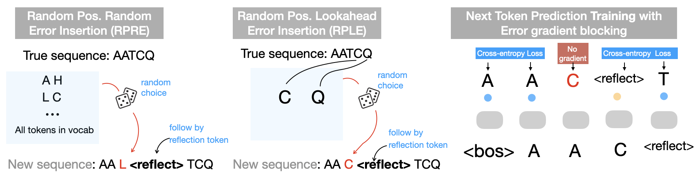

# Reflection Pretraining

This is the codebase and model weight for paper **Enabling Thinking, Reflecting and Chain-of-Thought Reasoning with Biological Sequences**



# Where did we implement relfection?

The error insersion is implemented in /ReflectionPT/components/transformer.py:tokenize( ... ) function. 

The training and model is implemented in /ReflectionPT/denovo/model.py
   
## Environment Setup


Create a new conda environment first:

```
conda create --name ReflectionPT python=3.10
```


```
conda activate ReflectionPT
```

then install dependencies:

```
pip install -r ./requirements.txt
```

## Model Inference

###  Download Required Files

To evaluate the provided test MGF file (you can replace this MGF file with your own), download the following files:

1. **Model Checkpoint**: [reflection_massive.ckpt](https://drive.google.com/file/d/1GyOVdIGCKueLMyAN_eyvkwMtal1P-ezH/view?usp=sharing)
2. **Test MGF File**: [Bacillus.10k.mgf](https://drive.google.com/file/d/1HqfCETZLV9ZB-byU0pqNNRXbaPbTAceT/view?usp=drive_link)


### Step 2: Run the Commands

Execute the following command in the terminal:

```bash
python -m ReflectionPT.ReflectionPT --mode=eval --peak_path=./bacillus.10k.mgf --model=./reflection_massive.ckpt
```

### Results

We provide a example output of the model here: 

The "<back>" from output is reflection token. 


